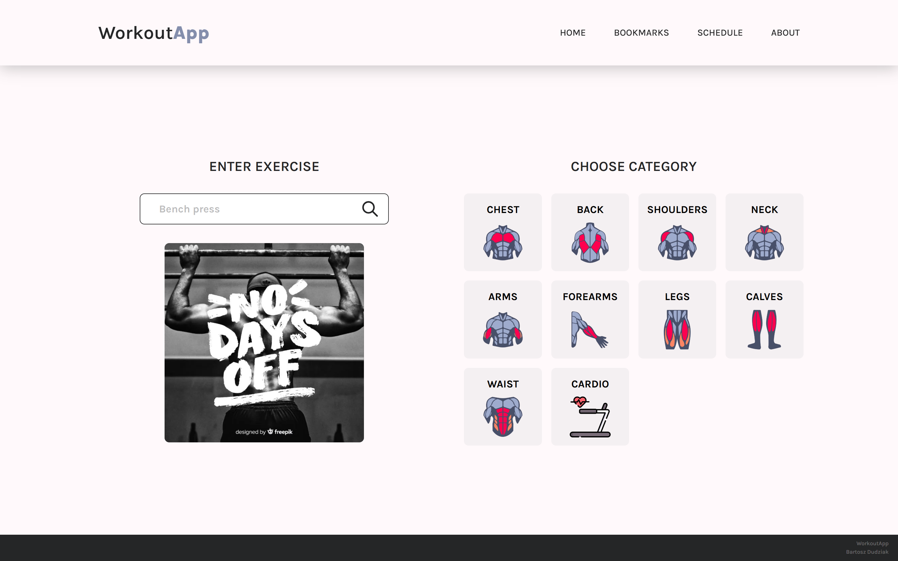

# Workout App

See the live version of [Workout App](https://workout-app-dudziak.netlify.app/).

A lightweight frontend app for browsing workout exercises, developed as a summary project after completing a JavaScript course. Built using the Publisher–Subscriber pattern and the MVP architectural pattern.

**Main features**:

- 🔍 Search & Explore
- 📝 Exercise Details
- ⭐ Workout Management
- 🎲 Schedule Generator
- 📩 Email Sharing
- 📱 Responsive Design

&nbsp;

## 💡 Technologies

&nbsp;

## 👏 Thanks

Thanks to [Jonas Schmedtmann](https://www.udemy.com/user/jonasschmedtmann/) – for providing me knowladge in his [Complete JavaScript Course](https://www.udemy.com/course/the-complete-javascript-course/).
